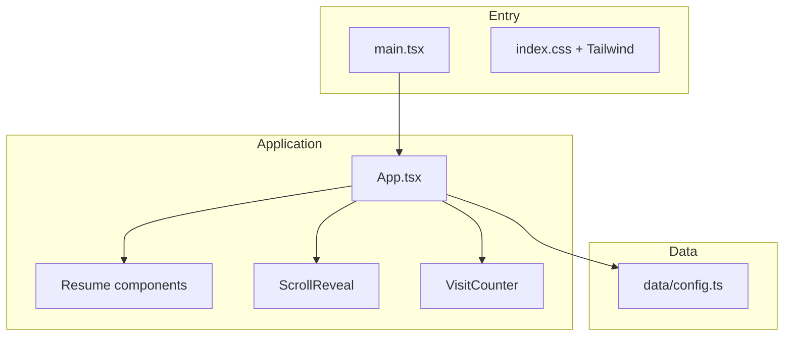

# Portfolio

A single-page developer portfolio built with **React**, **TypeScript**, and **Tailwind CSS**. Content is data-driven, the layout is responsive from phones to large desktops, and motion is used sparingly for scroll-based reveals. The production build is a static site suitable for edge hosting (for example **Vercel**, as referenced in the project’s metadata).

---

## Table of contents

- [Highlights](#highlights)
- [Technology stack](#technology-stack)
- [Architecture](#architecture)
- [Responsiveness & layout](#responsiveness--layout)
- [Styling & typography](#styling--typography)
- [Motion & accessibility](#motion--accessibility)
- [Content & configuration](#content--configuration)
- [Environment variables](#environment-variables)
- [Development](#development)
- [Build & preview](#build--preview)

---

## Highlights

| Area | Approach |
|------|----------|
| **UI** | React function components, declarative JSX, no class components |
| **Types** | Strict TypeScript with project references (`tsc -b`) |
| **Styling** | Tailwind CSS v4 via the Vite plugin; design tokens in `@theme` |
| **Bundling** | Vite 8 with `@vitejs/plugin-react` (Fast Refresh) |
| **Quality** | ESLint (React, Hooks, jsx-a11y, import sorting) + Prettier |
| **Icons** | Lucide React (tree-shakeable SVG icons) |

---

## Technology stack

### Runtime & UI

- **[React 19](https://react.dev/)** — UI library; root rendered with `createRoot` and `StrictMode`.
- **[React DOM](https://react.dev/reference/react-dom)** — Browser bindings for the single-page app mounted on `#root`.

### Language & tooling

- **[TypeScript ~6](https://www.typescriptlang.org/)** — Static typing across components, data, and utilities.
- **[Vite 8](https://vite.dev/)** — Dev server with HMR, optimized production builds, native ESM in development.
- **[@vitejs/plugin-react](https://github.com/vitejs/vite-plugin-react)** — Official React integration (including Fast Refresh).

### Styling

- **[Tailwind CSS v4](https://tailwindcss.com/)** — Utility-first CSS; imported in `src/index.css` with `@import 'tailwindcss'`.
- **[@tailwindcss/vite](https://tailwindcss.com/docs/installation/using-vite)** — Tailwind as a Vite plugin (no separate PostCSS pipeline required for the default setup).

### Animation

- **[Framer Motion](https://www.framer.com/motion/)** — Declarative animations; used for viewport-triggered section reveals (`whileInView`) in `ScrollReveal`.

### Icons

- **[Lucide React](https://lucide.dev/)** — Consistent stroke icons (e.g. menu, mail, external link) aligned with the visual language.

### Code quality

- **ESLint 9** (flat config) with:
  - `typescript-eslint` (recommended)
  - `eslint-plugin-react`, `eslint-plugin-react-hooks`, `eslint-plugin-react-refresh`
  - `eslint-plugin-jsx-a11y` (accessibility lint rules)
  - `eslint-plugin-import`, `eslint-plugin-simple-import-sort`, `eslint-plugin-unused-imports`
  - `eslint-config-prettier` (no style conflicts with Prettier)
- **Prettier** — Opinionated formatting (`format` / `format:check` scripts).

---

## Architecture

The app is a **client-only** React SPA: there is no custom backend in this repository. Optional third-party embeds (for example the visit counter image) load via URLs supplied at build time through environment variables.



| Path | Role |
|------|------|
| `index.html` | Document shell, viewport meta, fonts, SEO/Open Graph, JSON-LD `Person` schema |
| `src/main.tsx` | Bootstraps React and imports global styles |
| `src/index.css` | Tailwind import + `@theme` font variables |
| `src/App.tsx` | Page layout: header, hero, sections, footer-adjacent blocks |
| `src/data/config.ts` | Central **portfolio content** (person, resume sections) |
| `src/components/Resume/*` | Presentational blocks for competencies, jobs, education, etc. |
| `src/components/ScrollReveal.tsx` | Reusable motion wrapper for sections |
| `src/components/VisitCounter.tsx` | Optional embed driven by `VITE_*` env vars |
| `src/utils.ts` | Small helpers (e.g. email `mailto`, initials) |

---

## Responsiveness & layout

### Viewport & fluid base

- `index.html` sets `<meta name="viewport" content="width=device-width, initial-scale=1.0" />` so CSS pixels and touch behavior match device width.
- The shell uses **`min-h-dvh`** so the background fills the dynamic viewport height on mobile browsers where `100vh` can be misleading.

### Breakpoints (Tailwind defaults)

Tailwind’s responsive prefixes apply **min-width** media queries. Common ones used in this project:

| Prefix | Min width | Typical use here |
|--------|-----------|-------------------|
| *(none)* | 0 | Base (mobile-first) styles |
| `sm:` | 640px | Horizontal nav visible; hamburger hidden |
| `md:` | 768px | Hero + sidebar **two-column** grid |

Patterns in `App.tsx` include:

- **Header navigation** — Inline links use `hidden sm:flex` (hidden on small screens). A **mobile menu** (`sm:hidden` toggle button + collapsible panel) exposes the same anchor links with visible focus and hover states.
- **Hero** — Default single column; from `md:` upward, `md:grid-cols-[1.2fr_0.8fr]` places primary copy beside the “Links” card.
- **Typography** — Headline scales with `text-4xl sm:text-5xl` for readability on narrow screens without overwhelming large displays.
- **Grids** — Section grids use `sm:grid-cols-2` so cards flow in one column on phones and two when space allows.
- **Spacing** — Horizontal padding `px-6` and `max-w-5xl` keep line length and touch targets comfortable across sizes.

### Touch & interaction

- Mobile nav links close the menu on navigate (`onClick` handler) to avoid a stuck-open panel after in-page jumps.
- Buttons use `focus-visible` outlines for keyboard users.

---

## Styling & typography

- **Fonts** — [DM Sans](https://fonts.google.com/specimen/DM+Sans) for UI/body, [Fraunces](https://fonts.google.com/specimen/Fraunces) for headings (loaded from Google Fonts with `preconnect` in `index.html`). Mapped in `src/index.css` via `@theme` as `--font-sans` and `--font-serif`.
- **Color & depth** — Dark theme (`slate`/`sky`/`amber` accents), subtle **radial gradients** on a fixed background layer, **backdrop blur** on the sticky header, and borders/rings for hierarchy.
- **Utilities** — Spacing, flex/grid, typography, and state variants are expressed with Tailwind classes directly in JSX.

---

## Motion & accessibility

- **ScrollReveal** animates opacity and position when sections enter the viewport (`whileInView`), with configurable `viewport` and easing.
- **Semantic HTML** — `<header>`, `<main>`, `<section>`, `<nav>`, and heading levels structure the page.
- **ARIA** — Mobile menu uses `aria-expanded`, `aria-controls`, and `aria-label` on the toggle; navigation regions have distinct `aria-label` values where multiple `<nav>` elements exist.
- **Linting** — `eslint-plugin-jsx-a11y` helps catch common accessibility issues during development.

---

## Content & configuration

Resume and profile content live in **`src/data/config.ts`** (`portfolioConfig`). Updating that file updates the rendered site without changing layout code. The `App` component imports typed sections (competencies, technologies, experience, education, languages, etc.) and maps them into the `Resume` subcomponents.

---

## Environment variables

Optional features can be enabled via **Vite** env vars (must be prefixed with `VITE_` to be exposed to client code):

| Variable | Purpose |
|----------|---------|
| `VITE_VISIT_COUNTER_IMG_SRC` | Image URL for the visit counter embed |
| `VITE_VISIT_COUNTER_HREF` | Optional link wrapping the counter image |

See `src/components/VisitCounter.tsx` for behavior when variables are unset (development placeholder vs. silent omission in production).

---

## Development

**Requirements:** Node.js compatible with the toolchain (see `package.json` engines if added later) and npm.

```bash
npm install
npm run dev
```

Vite prints a local URL (typically `http://localhost:5173`). Edit files under `src/`; Fast Refresh updates the UI without losing component state in most cases.

**Other scripts:**

| Script | Description |
|--------|-------------|
| `npm run lint` | Run ESLint with zero warnings allowed |
| `npm run lint:fix` | ESLint with auto-fix where possible |
| `npm run format` | Format with Prettier |
| `npm run format:check` | Check formatting (CI-friendly) |

---

## Build & preview

```bash
npm run build
```

Runs **`tsc -b`** (TypeScript project build) then **`vite build`**, emitting static assets to `dist/`. Serve that folder from any static host or preview locally:

```bash
npm run preview
```

---

## License

This project is **private** (`"private": true` in `package.json`). Add a public license file if you open-source the repository.
